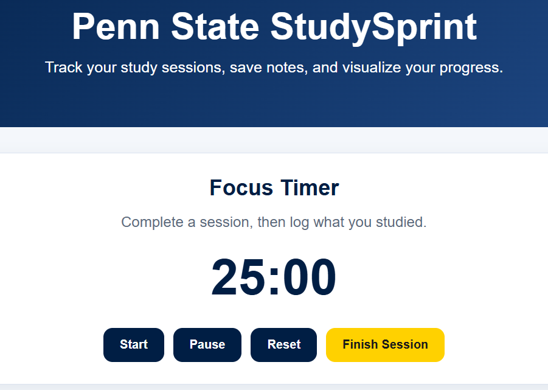
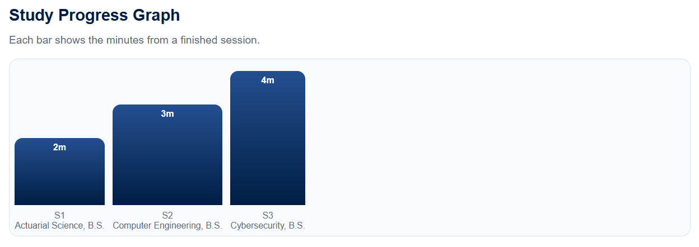
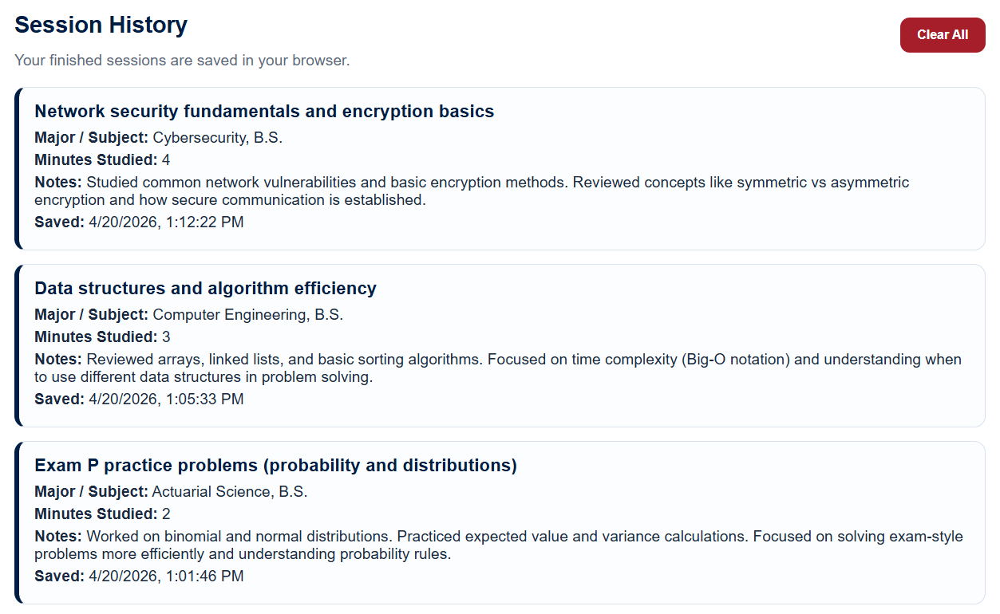

# Study Sprint (Penn State Edition)

---

## Overview

Study Sprint is a web-based study tracking application designed to help users create, manage, and visualize focused study sessions. 

This version of the project has been adapted into a static web application and deployed using GitHub Pages, allowing for easy access and demonstration without requiring backend hosting.

---

## Purpose

The purpose of Study Sprint is to:

* Help users track and manage study sessions
* Provide a structured way to stay focused while studying
* Allow users to log session details such as subject and notes
* Visually display progress using a session-based graph

---

## Technology Stack

* Frontend: HTML, CSS, JavaScript
* Data Storage: Browser LocalStorage
* Deployment: GitHub Pages

---

## Screenshots

### Timer & Session Controls

  

---

### Progress Graph

  

---

### Session History

  

---

## Features

* Focus timer (start, pause, reset)
* Finish Session button to log completed sessions
* Study notes input (major/subject and topic)
* Extra notes for session details
* Progress graph (bar chart of completed sessions)
* Session history display
* Local data persistence using browser storage

---

## Project Structure
StudySprint_Release/
├── index.html
├── style.css
├── script.js
├── README.md
└── images/
└── penn-state-logo.png

---

## How It Works

1. The user starts a study session using the timer
2. After completing the session, the user clicks "Finish Session"
3. The user enters study details (major, topic, notes)
4. The session is saved in the browser using LocalStorage
5. The progress graph updates with a new bar
6. The session history is displayed below

---

## Live Website

---

## Current Status

This project is a functional static MVP. It includes:

* A working timer system
* Session tracking and logging
* A visual progress graph
* A clean and responsive interface

The application is fully usable through GitHub Pages without requiring a backend server.

---

## Future Improvements

* Daily/weekly aggregated progress tracking
* Improved UI and animations
* User authentication system
* Cloud-based database integration
* Enhanced mobile responsiveness

---

## Team and Development

This project was developed collaboratively by:

- Cole Fetterman — Project Structure, Integration, and Deployment  
- Nelson Copete — Styling, Layout Design, and UI Enhancements  
- Zamman Qureshi — JavaScript Logic, Timer Functionality, and Data Handling  

Development was conducted collaboratively through group sessions over Discord, where all team members worked together in real time on the project.

While each member was assigned primary responsibilities, all components of the project were developed with shared input, discussion, and teamwork across the entire group.

---

## Development Notes

During development, the project transitioned from a full-stack application into a static version to simplify deployment and ensure reliability when hosted through GitHub Pages.

LocalStorage was implemented to simulate backend functionality, allowing session data to persist without requiring a database.

This approach ensured the project remained functional, accessible, and aligned with the goals of the assignment.

---

## Repository Link

https://github.com/ColeFettermanPSU/StudySprint_Release

---

## 📝 Development Logs

### Cole Fetterman
- **v1.0 (Apr 17, 2026):** Created initial project structure and directory layout  
- **v1.1 (Apr 18, 2026):** Built main HTML structure and integrated core sections  
- **v1.2 (Apr 19, 2026):** Connected timer, notes form, graph, and history components  
- **v1.3 (Apr 20, 2026):** Configured GitHub repository and deployed via GitHub Pages  
- Assisted with debugging and final feature integration across all components  

---

### Nelson Copete
- **v1.0 (Apr 17, 2026):** Designed initial UI layout and visual structure  
- **v1.1 (Apr 18, 2026):** Implemented Penn State themed color scheme and base styling  
- **v1.2 (Apr 19, 2026):** Styled timer, forms, graph, and navigation elements  
- **v1.3 (Apr 20, 2026):** Improved responsiveness and overall UI consistency  
- Contributed to design adjustments and user experience improvements  

---

### Zamman Qureshi
- **v1.0 (Apr 17, 2026):** Implemented base timer logic (countdown functionality)  
- **v1.1 (Apr 18, 2026):** Added timer controls (start, pause, reset)  
- **v1.2 (Apr 19, 2026):** Developed session saving system using LocalStorage  
- **v1.3 (Apr 20, 2026):** Built dynamic progress graph and session history rendering  
- Assisted with debugging and ensuring proper data handling throughout the application 
